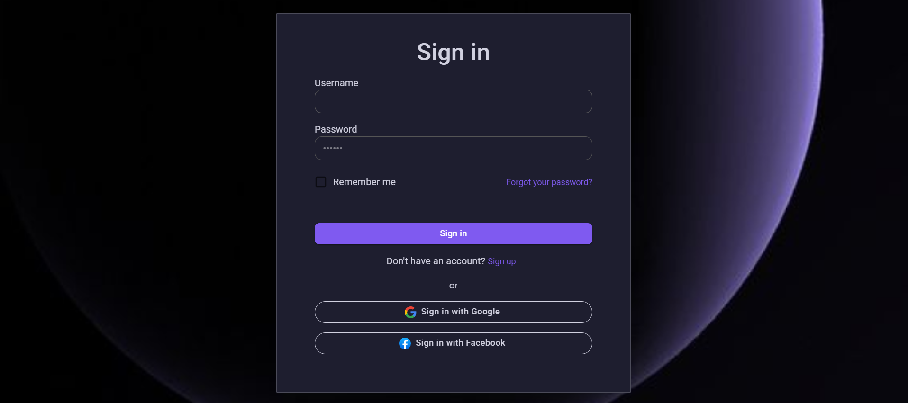
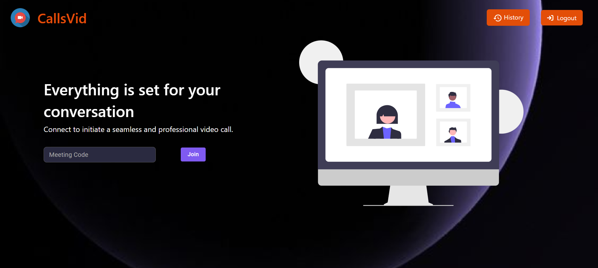
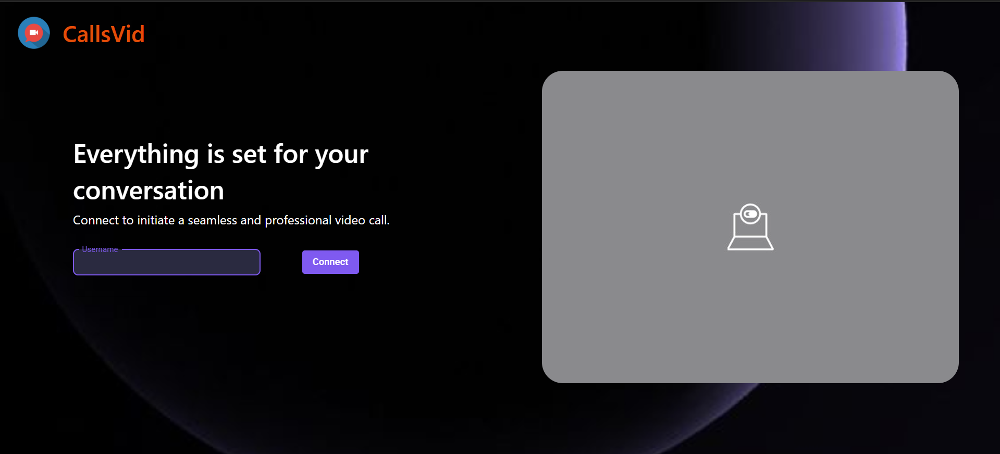
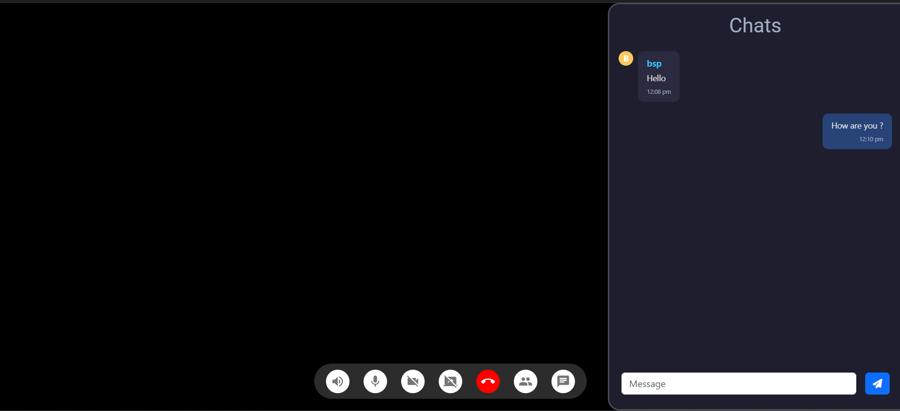
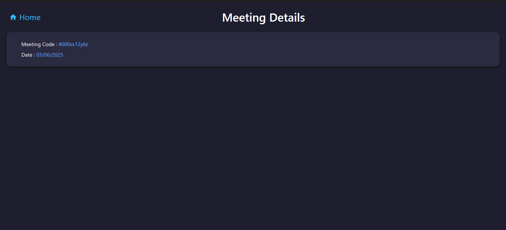

# 📞 CallsVid — Real-Time Video Calling App</h1> 

**CallsVid** is a real-time, peer-to-peer video calling web application designed to enable seamless one-on-one video communication directly in the browser. Built using modern web technologies like WebRTC, React, and Socket.IO, it provides a secure and responsive interface for users to initiate and receive video calls without requiring third-party tools or browser extensions.

<br>

## 🎯 Key Features

- 🎥 **Video Calling**  
  Establish peer-to-peer HD video calls using WebRTC.

- 🖥️ **Screen Sharing**  
  Seamlessly share your screen with the other participant during a call.

- 💬 **Live Chat**  
  Send and receive instant messages alongside video/audio communication.

- 🔗 **Room-Based Sessions**  
  Generate and join calls using unique room IDs.

- 🛠️ **WebSocket-Powered Signaling**  
  Built on Socket.IO for reliable and fast signaling between peers.

- 🧩 **Modular Architecture**  
  Clean React components with separate services and utilities.

<br>

## 📸 Screenshots

<!-- Add screenshots or GIFs here -->









<br>

## 🏗️ Tech Stack

### 🖥️ Frontend
- [React.js](https://reactjs.org/) – UI framework
- [WebRTC](https://webrtc.org/) – Real-time media stream handling
- [Socket.IO Client](https://socket.io/docs/v4/client-api/) – Signaling
- [Material Ui](https://mui.com/) – Styling

### 🌐 Backend
- [Node.js](https://nodejs.org/) – JavaScript runtime
- [Express.js](https://expressjs.com/) – Web server
- [Socket.IO](https://socket.io/) – Real-time WebSocket communication

<br>

## 🧭 Project Structure

```plaintext
CallsVid/
├── backend/
│   ├── src/
|   |   ├── controllers/
|   |   |   ├── socketManager.js
|   |   |   └── user.controller.js
|   |   ├── models/
|   |   |   ├── meeting.model.js
|   |   |   └── user.model.js
|   |   ├── routes/
|   |   |   └── users.routes.js
|   |   ├── app.js             
├── frontend/
│   └── src/
│       ├── App.jsx
|       ├── App.css
|       ├── main.jsx
|       ├── index.css
|       ├── utils/
|       ├── styles/
|       |   └── VideoMeet.css
|       ├── contexts/
|       |   └── AuthContext.jsx
│       ├── components/
│       │   ├── CustomIcons.jsx
│       │   └── ForgotPassword.jsx
│       └── pages/
│           ├── authentication.jsx
|           ├── landing.jsx
|           ├── signup.jsx
|           └── VideoMeet.jsx
├── README.md
└── LICENSE
